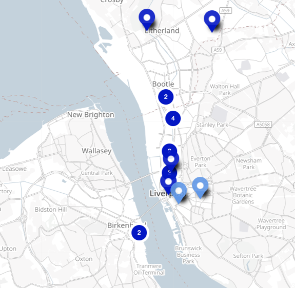

## LatourScope

The Latourscope is a folding origami map kit based on the work of Bruno Latour on critical zones from his [Inside Lecture](https://www.youtube.com/watch?v=gzPROcd1MuE).

He thinks the idea that we live on the vast surface of the globe of spaceship earth is deceptive, especially when trying to conceive of our ever changing ***bio-social*** and ***bio-political*** relationships to our home.

A soil scientists perspective is quite different to the mercantile globe maker; the ***critical zone*** for them is the tiny fragile vertical space that sustains human and non-human life; less than a kilometer above and below; which is more like a flat fragile veneer without which no life, no nature, no culture could exist.  

He imagines rather than sitting freely on the outside of a globe we sit comfortable (for now) ***inside*** intimate relations of microbiological soil systems & multitudes of dead and living plants and animals. We all know this veneer could be in crisis.

My map takes a cartesian space from Open Street Maps and the [Indie Manufacturing Project](http://indie.mcqn.com) and prints it beautifully on the inside of an origami lantern shape.

You have to carefully cut and fold your landscape and gently blow life into it. You then peer into the inner surface; try to get your bearings! Where are we ***really***?

Why make such a difficult map? You forget every map was once difficult, it took effort and now we take it for granted. But our easy mappings control our perspectives; how do you map our relations to soil? Where is the carbon web and who is not mapping it?

## Inside Indie Manufacturing

What else counts as a critical zone? Soil is of course the most important thing; and this is often made into an inconvenient externality, as other zones like surviving UK manufacturing sites become seemingly more critical. We rely on these relations also. Each map we make cuts away some relations and not others.

## Industrial Estate of Mind: Staying with the Trouble

What if we make industrial estates as precious as soil? But without erasing the soil they may damage? Maybe they could expose the soil they have erased? I've inserted a map of indie maunfacturing below so making this map we feel ***inside*** our supply chains which we are; but they all stack up on the microbial. We could imagine including a deeper time of silty marshlands of medieval Merseyside that made it a port for slavery and other cruel extractions made mobile.

Industrial Estate residents and soil scientists rarely interact, what maps could they make together? Where do they feel ***inside***?

How can we include the fragility of soil and other critical zones in the struggle to make ends meet in manufacturing and retail relations? What , soil scientists and real estate managers have to ask themselves is what a scientist in Robert McFarlane's book *Underland* asks, ***"Are we being good ancestors?"***

The [Indie Manufacturing Map](https://indie.mcqn.com/map/) map was research by MCQN Ltd on the distribution of independent makerspaces & manufacturing services in Liverpool and beyond. You can read more about the [data here](https://indie.mcqn.com/blog/2016/04/14/contributing-indie-manufacturing-data-to-open-street-map.html). Adrian McEwen of MCQN and cheapjack often talk about how this independence can foster different businesses as usual. Julian Todd described these independents and members of [DoESLiverpool](http://doesliverpool.com) fondly as 'corporate refugees'; maybe more like dissidents. Given independence from relentless market demands or being able to manage them differently could change what critical zones mean to different people and different kinds of labor.

## Getting Started

I've inserted an exported map from the indie maunfacturing project. When you’ve folded and expanded the map, look up the url hidden inside 

Cut away the origami instructions and follow them carefully. Once you have completed the classic origami ‘ball’ or ‘lantern’ you will need to gently blow into the tiny hole at the end to inflate the shape. 

You should keep the printed map elements on the inside. When complete flatten it slightly and cut away the round centre, where you inflated this is where you peer inside to see the map, it's best on basic foolscap paper as holding it up to the light helps illuminate the map inside

### Key

 * Dark Blue - Manufacturing services & trade counters

 * Light Blue - Makerspaces and Fablabs

 * *url* - The map source

 * *the present* - Latour also imagines overlapping complementary time & space dimensions. The 'top' nearest the hole we peer into is the most recent space, 'the present', in this case the aggregation of manufacturing services along the dock road on sandstone and topsoil is the most recent past, and the edge of the map, *past and far away* is also deeper into the sandstone bedrock, itself formed from an ancient ocean. We could imagine making the edges of the map blend into more ancient maps or data from places like [CITIZAN](https://citizan.org.uk/interactive-coastal-map/#zoom=1&lat=7000000.42789&lon=-449143.99347&layers=B00000FT) that discover [ancient pre-historic footprints](https://citizan.org.uk/blog/2016/Jan/28/prehistoric-footprints-first-lifeboat-station/)
